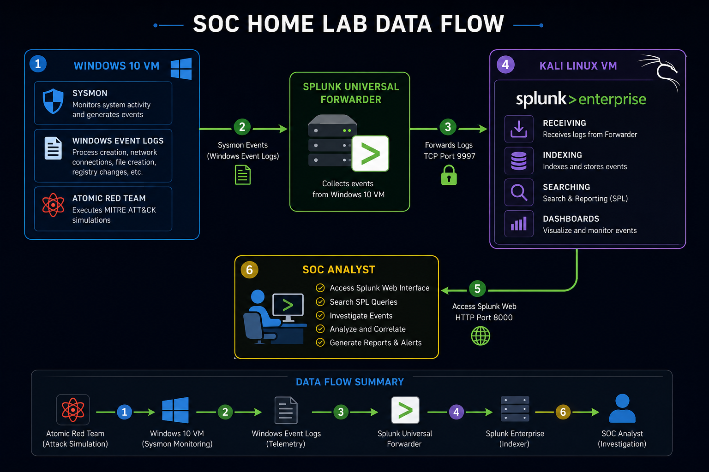
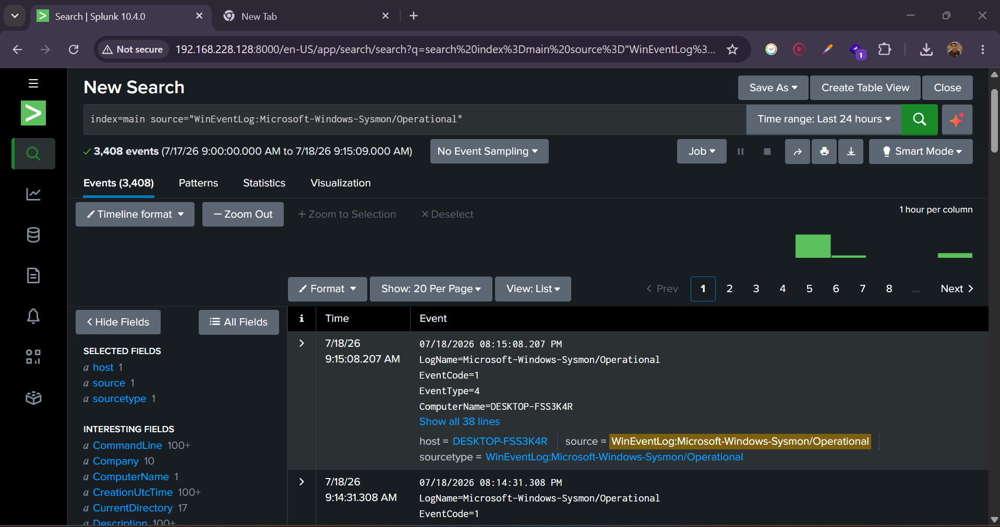
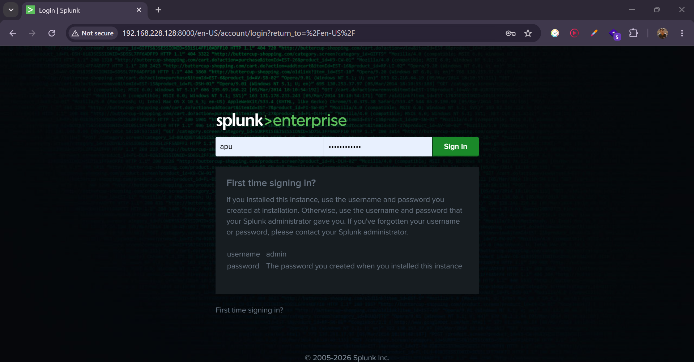
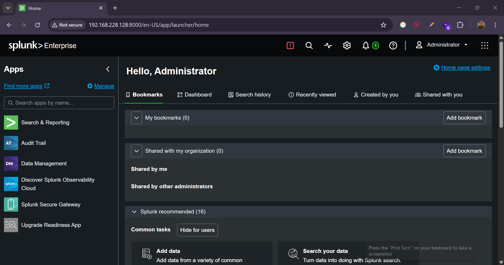

# SOC Home Lab with Splunk Enterprise

## Project Overview

This project demonstrates the creation of a Security Operations Center (SOC) Home Lab using Splunk Enterprise, Sysmon, Splunk Universal Forwarder, and Atomic Red Team.

The lab is designed to simulate real-world cyber attacks, collect Windows telemetry, forward logs to Splunk, and perform detection and investigation using MITRE ATT&CK techniques.

The primary objective of this project is to develop practical SOC analyst skills by building a complete home lab, simulating adversary techniques, detecting malicious activities, and investigating security events using Splunk Enterprise.


## Objectives

- Build a functional SOC Home Lab for security monitoring and threat detection.
- Collect Windows telemetry using Sysmon.
- Forward Windows logs using Splunk Universal Forwarder.
- Monitor logs with Splunk Enterprise.
- Simulate attacks using Atomic Red Team.
- Detect malicious activities using Splunk SPL queries.
- Map attacks to the MITRE ATT&CK Framework.
- Practice SOC investigation techniques.
- Document findings in professional investigation reports.

## Lab Architecture

The SOC Home Lab consists of a Kali Linux virtual machine hosting Splunk Enterprise and a Windows 10 virtual machine configured with Sysmon and the Splunk Universal Forwarder. Atomic Red Team is used to simulate MITRE ATT&CK techniques, while Splunk collects, indexes, and visualizes telemetry for investigation.

### Architecture Diagram


## Technologies Used

| Technology | Purpose |
| ---------- | ------- |
| Splunk Enterprise | Security Information and Event Management (SIEM) |
| Sysmon | Windows system activity logging |
| Splunk Universal Forwarder | Forwards Windows logs to Splunk |
| Atomic Red Team | Simulates MITRE ATT&CK techniques |
| Windows 10 | Target endpoint for attack simulation |
| Kali Linux | Hosts Splunk Enterprise SIEM |
| VMware Workstation | Virtualization platform |
| PowerShell | Executes attack simulation scripts and automation |
| MITRE ATT&CK Framework | Maps adversary behaviors and techniques |
| Git & GitHub | Version control, collaboration, and project documentation |
| Visual Studio Code | Documentation and project management |

## Lab Environment

| Component | Details |
| --------- | ------- |
| Host Machine | HP ProBook 430 G8 |
| Processor | Intel Core i5-1135G7 |
| RAM | 16 GB DDR4 |
| Hypervisor | VMware Workstation |
| SIEM Server | Kali Linux (Virtual Machine) hosting Splunk Enterprise |
| Endpoint | Windows 10 (Virtual Machine) |
| SIEM Platform | Splunk Enterprise |
| Log Collection | Sysmon + Splunk Universal Forwarder |
| Attack Simulation | Atomic Red Team |
| Network Mode | NAT |

## Network Topology

The SOC Home Lab is deployed in VMware Workstation using a NAT virtual network. The environment consists of two virtual machines: a Kali Linux VM running Splunk Enterprise and a Windows 10 VM configured with Sysmon, Splunk Universal Forwarder, and Atomic Red Team.

Sysmon collects detailed Windows endpoint telemetry, while the Splunk Universal Forwarder securely forwards the generated logs to the Splunk Enterprise server on TCP port 9997. Splunk indexes the incoming events and provides a web interface accessible through HTTP on port 8000 for monitoring, searching, and investigation.

All virtual machines communicate over the same NAT network, allowing secure connectivity without exposing the lab directly to the external network.

                 HP ProBook 430 G8
                  (Host Machine)
                         │
                  Web Browser
               (Splunk Web UI)
                  HTTP :8000
                         │
                         ▼

            ┌──────────────────────┐
            │    Kali Linux VM     │
            │                      │
            │ Splunk Enterprise    │
            │ Indexer + Web UI     │
            └─────────▲────────────┘
                      │
          TCP 9997 (Forwarded Logs)
                      │
                      │
            ┌─────────┴────────────┐
            │    Windows 10 VM     │
            │                      │
            │ Sysmon               │
            │ Splunk UF            │
            │ Atomic Red Team      │
            └──────────────────────┘


Network Communication

| Source          | Destination   | Protocol   | Port  | Purpose                                              |
| --------------- | ------------- | ---------- | ----- | ---------------------------------------------------- |
| Windows 10 VM   | Kali Linux VM | TCP        | 9997  | Forward Sysmon logs using Splunk Universal Forwarder |
| Host Browser    | Kali Linux VM | HTTP       | 8000  | Access Splunk Enterprise Web UI                          |
| Atomic Red Team | Windows 10 VM | PowerShell | Local | Execute MITRE ATT&CK simulations                           |


Virtual Machines

| Machine       | Role                                                    |
| ------------- | ------------------------------------------------------- |
| Kali Linux VM | Splunk Enterprise Server (Indexer & Web UI)             |
| Windows 10 VM | Endpoint for attack simulation and telemetry collection |
| Host Computer  | SOC Analyst workstation for accessing Splunk            |

This topology enables centralized log collection, attack simulation, and security monitoring in an isolated virtual environment.

## Data Flow

The data flow within the SOC Home Lab follows a simple but realistic Security Operations Center workflow. Attack activities generated on the Windows 10 virtual machine are monitored by Sysmon, collected by the Splunk Universal Forwarder, transmitted to the Splunk Enterprise server running on the Kali Linux virtual machine, and finally analyzed through the Splunk Web interface.

This workflow demonstrates how endpoint telemetry is collected, centralized, and investigated using SIEM technology.

### Data Flow Diagram



### Data Flow Process

1. Atomic Red Team executes attack simulations on the Windows 10 virtual machine.

2. Sysmon monitors system activities including:
   - Process Creation
   - Network Connections
   - DNS Queries
   - File Creation
   - Registry Modifications

3. Sysmon generates Windows Event Logs.

4. Splunk Universal Forwarder collects the generated logs.

5. The forwarder securely sends the logs to Splunk Enterprise over TCP Port **9997**.

6. Splunk Enterprise running on the Kali Linux virtual machine receives and indexes the events.

7. The SOC analyst accesses Splunk Web on **HTTP Port 8000** using a web browser.

8. SPL queries are used to detect attacker activities, investigate events, and analyze indicators of compromise.

### Data Flow Summary

| Stage | Component | Description |
|-------|-----------|-------------|
| 1 | Atomic Red Team | Simulates attacker behavior |
| 2 | Sysmon | Monitors endpoint activity |
| 3 | Windows Event Logs | Stores telemetry |
| 4 | Splunk Universal Forwarder | Collects logs |
| 5 | TCP Port 9997 | Transfers logs to SIEM |
| 6 | Splunk Enterprise | Receives and indexes logs |
| 7 | Splunk Search & Reporting | Searches and analyzes logs |
| 8 | SOC Analyst | Performs investigation |

### Live Sysmon Events in Splunk

The screenshot below demonstrates that Sysmon events generated on the Windows endpoint are successfully forwarded to Splunk Enterprise and are available for real-time investigation.


**Figure:** Splunk Enterprise displaying live Sysmon Event ID 1 (Process Creation) logs received from the Windows 10 endpoint through Splunk Universal Forwarder.

## Installation Guide

## Prerequisites

Before setting up this SOC Home Lab, ensure your host machine meets the following minimum requirements.

| Component | Requirement |
|-----------|-------------|
| Host Operating System | Windows 10 or Windows 11 (64-bit) |
| Virtualization Software | VMware Workstation |
| Processor | 64-bit CPU with Virtualization (Intel VT-x or AMD-V) |
| Memory (RAM) | Minimum 16 GB |
| Storage | At least 100 GB of free disk space |

### Software Required

- VMware Workstation
- Kali Linux (Virtual Machine)
- Windows 10/11 (Virtual Machine)
- Splunk Enterprise
- Sysmon
- Splunk Universal Forwarder
- Atomic Red Team

## Lab Setup Overview

This SOC Home Lab consists of two virtual machines running on VMware Workstation.

| Virtual Machine | Purpose |
|-----------------|---------|
| Kali Linux | Hosts Splunk Enterprise to collect, search, and analyze security logs. |
| Windows 10 | Acts as the monitored endpoint running Sysmon, Splunk Universal Forwarder, and Atomic Red Team. |

Both virtual machines are connected using VMware NAT networking, allowing the Windows endpoint to securely forward logs to the Splunk server while maintaining network connectivity.

After completing the basic virtual machine setup, the remaining sections focus on configuring the core SOC components, including Splunk Enterprise, Sysmon, Splunk Universal Forwarder, log forwarding, log verification, and attack simulation using Atomic Red Team.

## Install Splunk Enterprise

### Purpose

Splunk Enterprise serves as the Security Information and Event Management (SIEM) platform in this SOC Home Lab. It collects, indexes, searches, and visualizes logs generated by the Windows endpoint, enabling security monitoring and incident investigation.

---

### Installation Steps

1. Download the latest Splunk Enterprise package for Linux from the official Splunk website.

2. Copy the installation package to the Kali Linux virtual machine.

3. Open a terminal and navigate to the directory containing the downloaded package.

4. Install Splunk using the following command:

```bash
sudo dpkg -i splunk-<version>-linux-amd64.deb
```

> Replace `<version>` with the downloaded package version.

5. Start Splunk for the first time.

```bash
sudo /opt/splunk/bin/splunk start --accept-license
```

6. Create an administrator username and password when prompted.

7. Enable Splunk to start automatically during system boot.

```bash
sudo /opt/splunk/bin/splunk enable boot-start
```

---

### Verification

Verify that Splunk is running successfully.

```bash
sudo /opt/splunk/bin/splunk status
```

Expected output:

```
splunkd is running
```

---

### Access the Web Interface

Open a web browser and navigate to:

```
http://<Kali-IP>:8000
```

Example:

```
http://192.168.xxx.xxx:8000
```

Log in using the administrator credentials created during the installation.

---

### Screenshot

<p align="center">
  
</p>

**Figure 1:** Splunk Enterprise login page accessible through the web interface after a successful installation.


<p align="center">
  
</p>

**Figure 2:** Splunk Enterprise Search & Reporting dashboard confirming a successful installation and an operational SIEM environment.


## Install Sysmon

## Install Splunk Universal Forwarder

## Configure Log Forwarding

## Verify Log Collection

## Install Atomic Red Team

## Troubleshooting

## Attack Simulations

## Splunk Detection Queries

## Investigation Reports

## Skills Demonstrated

## Project Structure

## Future Improvements

## Acknowledgements
