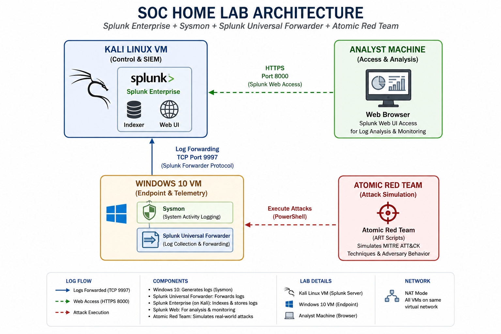

# SOC Home Lab with Splunk Enterprise

## Project Overview

This project demonstrates the creation of a Security Operations Center (SOC) Home Lab using Splunk Enterprise, Sysmon, Splunk Universal Forwarder, and Atomic Red Team.

The lab is designed to simulate real-world cyber attacks, collect Windows telemetry, forward logs to Splunk, and perform detection and investigation using MITRE ATT&CK techniques.

The primary objective of this project is to develop practical SOC analyst skills by building a complete home lab, simulating adversary techniques, detecting malicious activities, and investigating security events using Splunk Enterprise.

## Objectives

- Build a functional SOC Home Lab for security monitoring and threat detection.
- Collect Windows telemetry using Sysmon.
- Forward Windows logs using Splunk Universal Forwarder.
- Monitor logs with Splunk Enterprise.
- Simulate attacks using Atomic Red Team.
- Detect malicious activities using Splunk SPL queries.
- Map attacks to the MITRE ATT&CK Framework.
- Practice SOC investigation techniques.
- Document findings in professional investigation reports.

## Lab Architecture

The SOC Home Lab consists of a Kali Linux virtual machine hosting Splunk Enterprise and a Windows 10 virtual machine configured with Sysmon and the Splunk Universal Forwarder. Atomic Red Team is used to simulate MITRE ATT&CK techniques, while Splunk collects, indexes, and visualizes telemetry for investigation.

### Architecture Diagram

## Technologies Used

| Technology | Purpose |
|------------|---------|

| Splunk Enterprise | Security Information and Event Management (SIEM) |
| Sysmon | Windows system activity logging |
| Splunk Universal Forwarder | Forwards Windows logs to Splunk |
| Atomic Red Team | Simulates MITRE ATT&CK techniques |
| Windows 10 | Target endpoint for attack simulation |
| Kali Linux | Hosts Splunk Enterprise SIEM |
| VMware Workstation | Virtualization platform |
| PowerShell | Executes attack simulation scripts and automation |
| MITRE ATT&CK Framework | Maps adversary behaviors and techniques |
| Git & GitHub | Version control, collaboration, and project documentation |
| Visual Studio Code | Documentation and project management |

## Lab Environment

| Component | Details |
|-----------|---------|

| Host Machine | HP ProBook 430 G8 |
| Processor | Intel Core i5-1135G7 |
| RAM | 16 GB DDR4 |
| Hypervisor | VMware Workstation |
| SIEM Server | Kali Linux (Virtual Machine) hosting Splunk Enterprise |
| Endpoint | Windows 10 (Virtual Machine) |
| SIEM Platform | Splunk Enterprise |
| Log Collection | Sysmon + Splunk Universal Forwarder |
| Attack Simulation | Atomic Red Team |
| Network Mode | NAT |

## Network Topology

## Data Flow

## Installation Guide

## Attack Simulations

## Splunk Detection Queries

## Investigation Reports

## Skills Demonstrated

## Project Structure

## Future Improvements

## Acknowledgements
